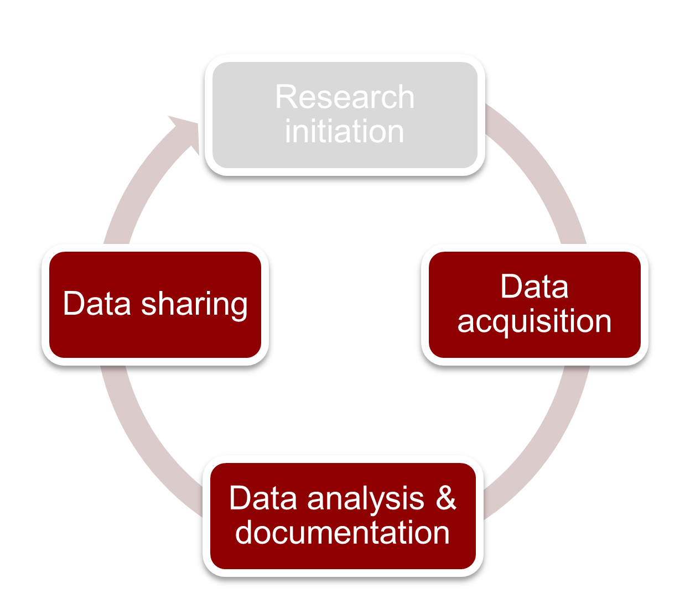

The Research Data Life Cycle
***************

Data management plan
====================

Main question to be answered by the plan: which data is stored at where and why and who has access to the data.

But the first question is what it means to question at all.

FAIR, scientific integrity, open science, reproducible science ...

    Figure: Research Lifecycle