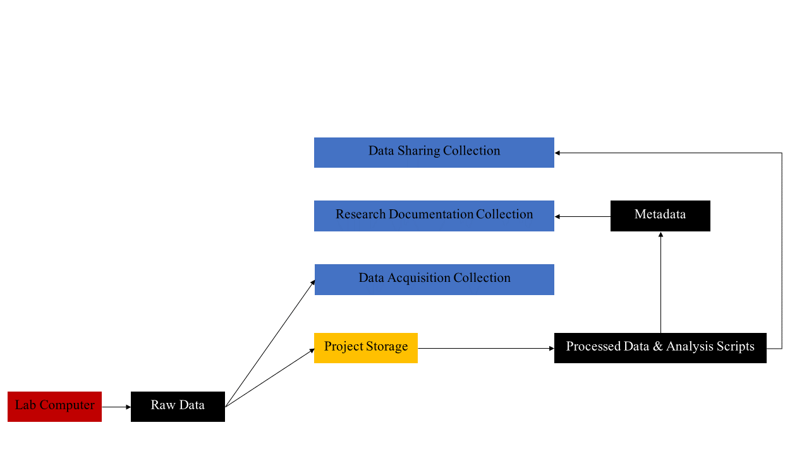

Donders Repository
****************************

The Donders Repository is a data repository for researchers of the the Donders Institute to archive and/or publish their research data. 

Data on the Donders Repository more difficult to access than data on Central or Local Storage. 
Therefore, it serves the purpose of backing up data so that, in the case of accidental deletion on Central Storage, it can still be retrieved. 
Additionally, it serves the purpose of improving research documentation for better reproducibility. 
Finally, it also serves the purpose of hosting data after the completion of the project. 
It is hosted at https://data.donders.ru.nl/. 

    Figure: Data Managegment Workflow with the Donders Repository

The pdf version of this image (with active hyperlinks) can be found at: https://data.donders.ru.nl/doc/help/helppages/dr-nutshell.html?27

Data Acquisition Collections
==============
Data Acquisition Collections contain raw data. 
Its purpose is to ensure that data are archived without any manipultions which limit the potential for future research.
Additionally, it ensures that in the event of accidental deletion of data in the project folder, this data is not lost. 
Consequently, it enables researchers to delete the raw files of data in the project folder after these files are processed. 
Researchers may wish to delete the raw files in the project folder to ensure that they stay under their storage quota.

Data Acquisition Collections can be found at the Donders Repository with the following identifier:

``di.dccn.DAC_1234567.89_XXX``

Here DAC refers to Data Acquisition Collection, 1234567.89 refers to the Project Number, and XXX can be any three random digits.

Research Documentation Collections
==================
Research Documentation Collections contain documents. 
Its purpose is to memorandize the process by which raw data came to lead to your published results. 
You must request a Research Documentation Collection for your project.

Research Documentation Collections can be found at the Donders Repository with the following identifier:

``di.dccn.RDC_1234567.89_XXX``

Here RDC refers to Research Documentation Collection, 1234567.89 refers to the Project Number, and XXX can be any three random digits. 
These are not the same random digits as those in the Data Acquistion Collection identifier for the same project.

Data Sharing Collections
====================
Data Sharing Collections contain processed data and analysis scripts. 
Its purpose is to enable researchers to reanalyze the data with new methods and/or address new research questions with this data. 
There are two kinds of Data Sharing Collections: private and public. 
Public Data Sharing Collections are available for download for all researchers at https://data.donders.ru.nl. 
These collections must be completely anonymized and may not contain any potentially identifying information. 
Access to private Data Sharing Collections, like Data Acquisition Collections and Research Documentation Collections, must be granted by the collection's manager.

Data Acquisition Collections can be found at the Donders Repository with the following identifier:

``di.dccn.DSC_1234567.89_XXX``

Here DSC refers to Data Sharing Collection, 1234567.89 refers to the Project Number, and XXX can be any three random digits. 
These are not the same random digits as those in the Data Acquistion Collection identifier or the Research Documentation Collection identifier for the same project.

Throughout the life cycle of your project, you will have to move data between storage facilities. 
You are encouraged to think about how you will do this with a Data Management Plan.