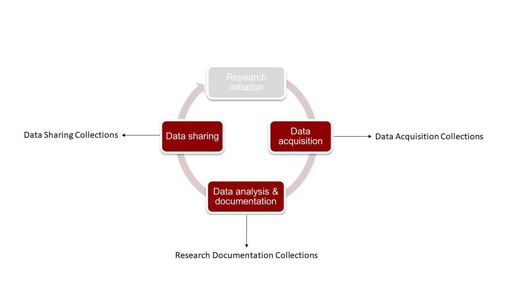

Donders Repository
****************************

About
-----

The Radboud Data Repository is a data repository for researchers of Radboud University to archive and/or publish their research data. 

Data on the Radboud Data Repository serve the purpose of backing up data so that, in the case of accidental deletion on Central Storage, it can still be retrieved. 
Additionally, it serves the purpose of improving research documentation for better reproducibility. 
Finally, it also serves the purpose of hosting data after the completion of the project. 
It is hosted at https://data.ru.nl/. 
It is also accessible on the ``R:\`` drive on Network PCs or the ``/repository/`` folder on the HPC Cluster. 
However, we will not discuss accessing files via these means. 

    Figure: Data Managegment Workflow with the Donders Repository

.. toctree::
   :maxdepth: 1
   
   Data Acquisition Collections <2_3_1.rst>
   Research Documentation Collections <2_3_2.rst>
   Data Sharing Collections <2_3_3.rst>
