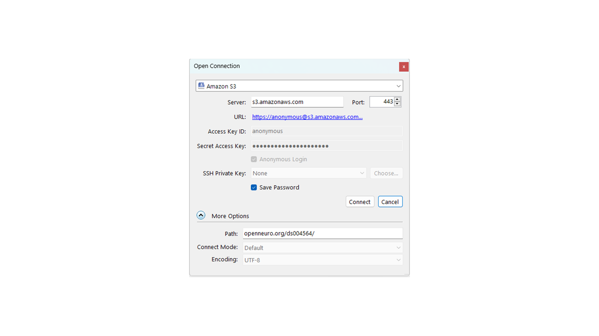

Using Existing Datasets
********

When dealing with any data (real or simulated) during the :bdg-warning:`Planning Research` stage, you will most often want to store it in your :bdg-primary:`Home Drive`. 
This is because, since the :bdg-primary:`Home Drive` is mounted on :bdg-primary:`High Performance Storage`, you will be able to work with the :bdg-primary:`HPC Cluster` which can speed up your analysis time. 
Otherwise, you would use the :bdg-primary:`local storage` on your PC. 

Let's see how we would download data.

Private Collection with Repocli
==========

Once you have been added to a collection, you will receive an email to the email account you used when you signed up to the Radboud Data Repository stating that you have been added. 
We have added you to the ``DSC_3010000.05_519`` collection - a private Collection - so that you can get practice downloading privately shared data. 
You should never download private collections onto your personal computer to ensure that - if the researchers made a mistake - there are no chances of data leakages. 
We will practice downloading this DSC onto your Home Drive (replace groupname with your lab group's name and firlas with your DCCN username)

1. Establish a Network Connection to Trigon (either eduVPN or hardwired)

2. Login to the :bdg-primary:`Radboud Data Repository`

* Open TigerVNC
* Open the terminal application
* Type ``repocli shell`` and then push ``enter``
* Type ``login`` and then push ``enter``
* Enter your RU username (u1234567@ru.nl) and then push ``enter``
* Enter your RU password and then push ``enter``
* Push ``y`` and then push ``enter``

3. Download the Data Sharing Collection to Your Home Directory

* Type ``get dccn/DSC_3010000.05_519 /home/groupname/firlas``

Public Collection with Cyberduck
==========

1. Establish a Network Connection to Trigon (either eduVPN or hardwired)

2. Login to the :bdg-primary:`Radboud Data Repository`

* Open Cyberduck
* Click ``Open Connection`` at the top left of the window
* Click on the dropdown menu (which defaults to ``File Transfer Protocol (FTP)``) and select ``WebDAV (HTTPS)`` 
* At the ``Server:`` field type in ``data.ru.nl``
* Click the box next to ``Anonymous Login`` and then click ``Connect`` at the bottom right side of the window

3. Download the Data Sharing Collection to Your Folder of Choice

* Double click on the ``dccn`` directory 
* Single click on the ``DSC_3010000.11_518_v1`` directory 
* Locate and click on ``Action`` at the top of the window and then select ``Download To`` on the dropdown menu
* Select the folder you want to download the data to and then push ``Ok``
* Select the disconnect button at the top right of the window

Other Repositories with Cyberduck
==========

.. _Demo: https://openneuro.org/datasets/ds004564/versions/1.0.1
Let's say you have found a data collection you want to analyze on OpenNeuro called `Demo`_. 
Before you can go about downloading it with :bdg-dark:`Cyberduck` or :bdg-dark:`Repocli`, you must determine which protocol you must use to interact with the server. 
Below is a list of the Protocols required by some commonly used Open Access Repositories. 

.. table::
   :widths: auto

   +------------+----------+-----------+--------+
   | Repository | OpenfMRI | OpenNeuro | OMEGA  | 
   +============+==========+===========+========+
   | Protocol   | AWS      | AWS       | WebDAV |
   +------------+----------+-----------+--------+

1. Establish an AWS Connection to the OpenNeuro folder you want to download

* Open Cyberduck and push ``Open Connection``
* Click on the dropdown menu which defaults to ``FTP (File Transfer Protocol)`` and select ``Amazon S3``
* Click on the dropdown for more options and copy the domain name and the dataset number, seperated by a forward slash (i.e. ``openneuro.org/ds004564``) into the ``Path:`` field
* In the ``Access Key ID:`` field, type ``anonymous``

* Click ``connect``

2. Download the fMRI data

* Control-click the data you want to download (so the subject data folders and the ``participants.tsv`` file)
* Click ``Action`` and then ``Download To`` in the dropdown
* Select the directory you want to download the data to and then push ``OK``