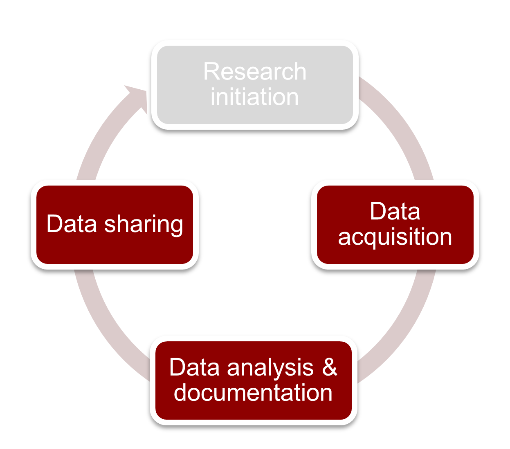

The Research Data Life Cycle
***************

This introduces the idea of the research life cycle and how research data has a life cycle which mirrors it. 
We also explain how the life cycle of research data should be explained in a data management plan. 

**The Four Stages of the Research Cycle**
====================
There are 4 stages of research which also mirror the research data life cycle.

    Figure: Research Lifecycle

.. table::
   :widths: auto

   +-------------------+-----------------------------+-----------------------------+-----------------------------+-----------------------------+
   |                   | Initiation                  | Data Acquisition            | Analysis and Documentation  | Sharing                     |
   +===================+=============================+=============================+=============================+=============================+
   +-------------------+-----------------------------+-----------------------------+-----------------------------+-----------------------------+
   | *Starts With*     | Research Question           | Project Proposal Approval   | Final Subject               | Article is Accepted         |
   +-------------------+-----------------------------+-----------------------------+-----------------------------+-----------------------------+
   | *Ends With*       | Project Proposal Approval   | Final Subject               | Article is Accepted         | Data is FAIR                |
   +-------------------+-----------------------------+-----------------------------+-----------------------------+-----------------------------+
   | *Tasks*           | Designing Experiment        | Recruiting Subjects         | Preprocessing Data          | Make data FAIR              |
   |                   | Running Simulations         | Running Subjects            | Analyzing Data              | Anonymize Data              |
   |                   | Analyzing Existing Data     |                             | Writing Results             |                             |
   +-------------------+-----------------------------+-----------------------------+-----------------------------+-----------------------------+
   | *Data*            | Analysis Scripts            | Raw Data Files              | Processed Data Files        | Analysis Scripts            |
   |                   | Existing Datasets           | Metadata                    | Analysis Scripts            | Processed Data Files        |
   |                   | Experiment Script           | Surveys                     | Figures                     | Metadata                    |
   +-------------------+-----------------------------+-----------------------------+-----------------------------+-----------------------------+

**Data Management Plan**
====================

The data management plan outlines *what* data is stored *where* and *when*, *who* has access to the data and *why*?

At the DCCN, we have Standard Operating Procedures (SOPs) which have been developed as a guideline which answers these questions for the researcher.

These SOPs were developed for data sets which fall under the blanket ethical approval. 
Read more about the SOPs for Research Data Managment here:
  https://intranet.donders.ru.nl/fileadmin/user_upload/DCCN/Research/Standard_Operating_Procedures/RDM_compliance_monitoring_SOP_20180621.pdf
 and the SOPs for Preventing Data Leaks here:
  https://intranet.donders.ru.nl/fileadmin/user_upload/DCCN/Research/CMO_Ethics_2016/NewTemplates_SOP/DataLeakage_SOP_DCCN_version_1_0_Sept_2016_newtemplate_01.pdf

If your study does not fall under the blanket ethical approval, you should contact the Data Steward for the DCCN: steven.ligthert@donders.ru.nl

Storage
---------

Moving data between storage facilities intuitively follows the researcher's needs and objectives at each point in the Research Life Cycle. 

.. figure:: images/Storage-layers-dccn.png
    :figwidth: 100%
    :align: center

    Figure: DCCN storage layers

We will now shift our focus to the tools used to transfer data between data storage facilities.