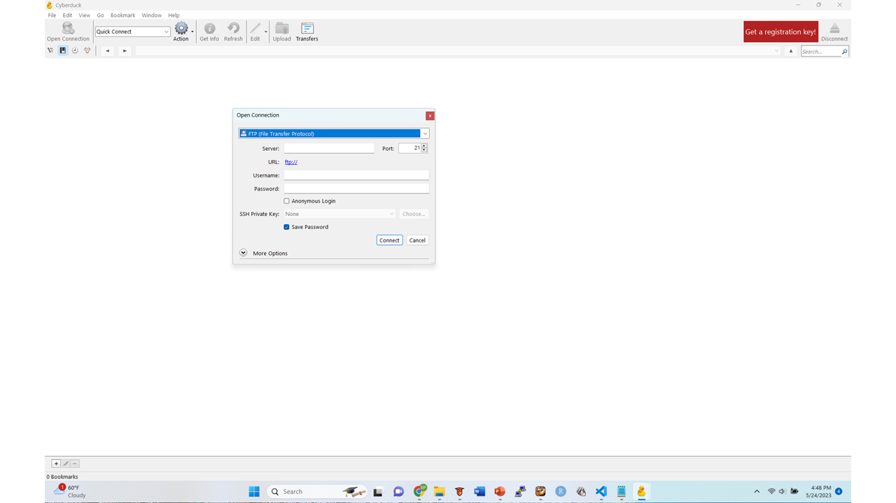

.. _`Cyberduck`: http://cyberduck.io
.. _`Exercises Using Cyberduck`: https://rdm.dccn.nl/docs/tools.html

`Cyberduck`_
**********

About
=====
* A graphical tool for transferring data from the local computer
* It runs in both Windows and MacOSX
* Generic Graphical User Interface WebDAV client
* Installed onto all DCCN Computers and its use is supported in the DCCN 

Capabilities
============
* Enables transfer between Local Storage and Central Storage (SFTP)
* Enables transfer between Local Storage and the Donders Repository (HTTPS) 
* Enables transfer between Local Storage and Open Access Data Repositories (i.e. HTTPS, AWS)

Benefits
========
* Extremely easy to use 
* Serves multiple purposes
* A generic tool 

`Exercises Using Cyberduck`_

