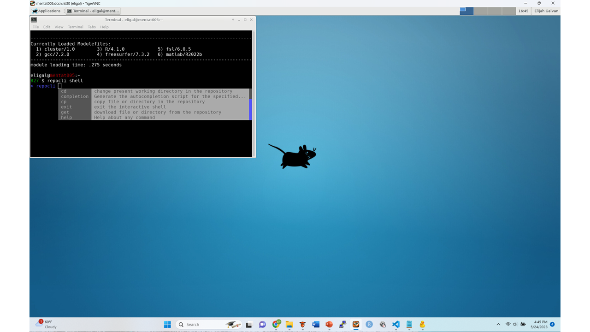

Repocli
**********

https://github.com/Donders-Institute/dr-tools/tree/main/cmd/repocli

About
=====
* A command-line tool for transferring data to the Donders Repository from either Local Computers or the HPC Cluster.  
* Runs in Windows, MacOSX and Linux. 
* Enables the user to script the upload or download of specific files from any repository. 
* A generic data transfer tool with a steep learning curve. 

Capabilities
============
* Enables transfer between Local Storage and the Donders Repository
* Enables transfer between Central Storage and the Donders Repository

Benefits
=======
* Operations are much more robust than with other tools 
* Enables specification which can substantial minimize user error and maximize efficiency.

Exercises Using Repocli
=========================

.. _Exercise 3: https://rdm.dccn.nl/docs/6_initiation/6_2/6_2_3.html
.. _Exercise 8: https://rdm.dccn.nl/docs/6_initiation/6_4/6_4_2.html

* `Exercise 3`_: Download data from a collection you have been added to with Repocli
* `Exercise 8`_: Uploading analysis files to my new DAC from my Project Folder with Repocli