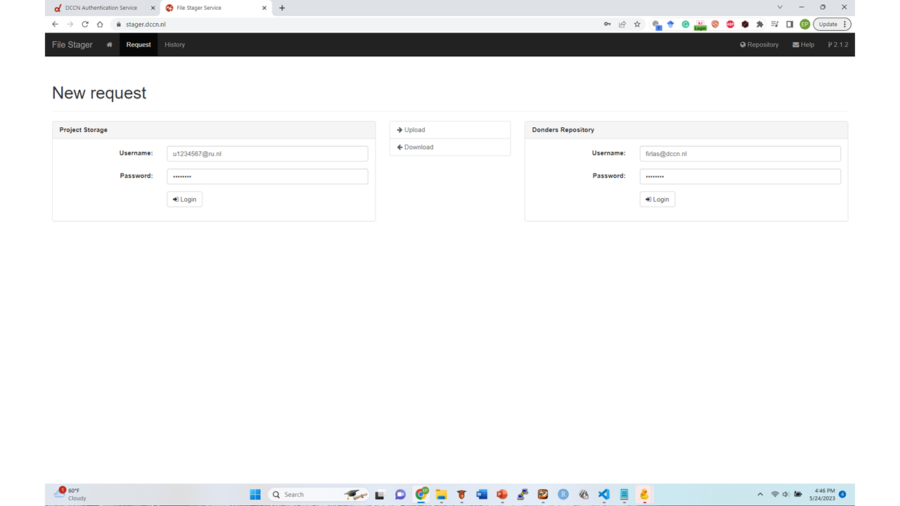

Stager
******

https://stager.dccn.nl

About
=====
* A web-based tool which efficiently enables the user to move data between Project Storage and the Donders Repository 
* Requires the user to be connected to the Trigon Network - either physically or via VPN
* Specifically created for DCCN use

Capabilities
============
* Enables transfer between the Project Storage and Donders Repository

Benefits
=======
* Extremely easy-to-use

Exercises Using Stager
======================

.. _Exercise 10: https://rdm.dccn.nl/docs/8_analysis/8_3/8_3_1.html
.. _Excercise 13: https://rdm.dccn.nl/docs/9_sharing/9_3/9_3_2.html

* `Exercise 10`_: Restoring Lost Data with Stager
* `Excercise 13`_: Staging Data from the Project Folder to the Data Sharing Collection