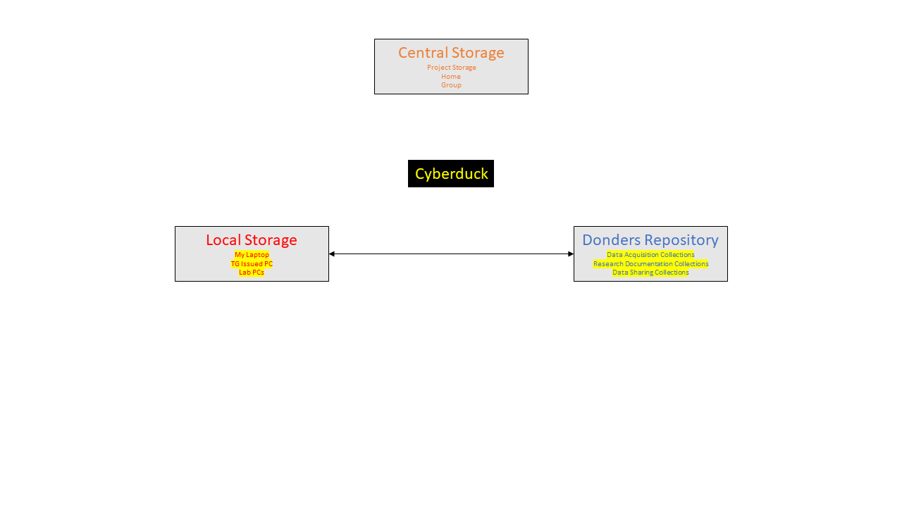
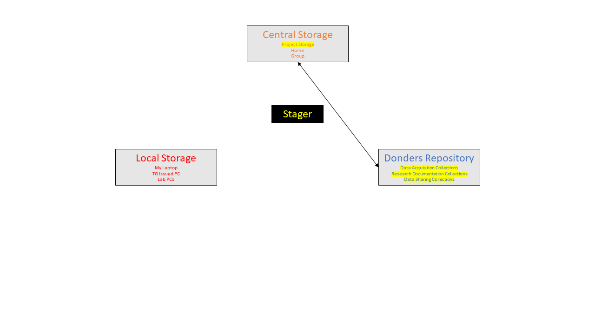
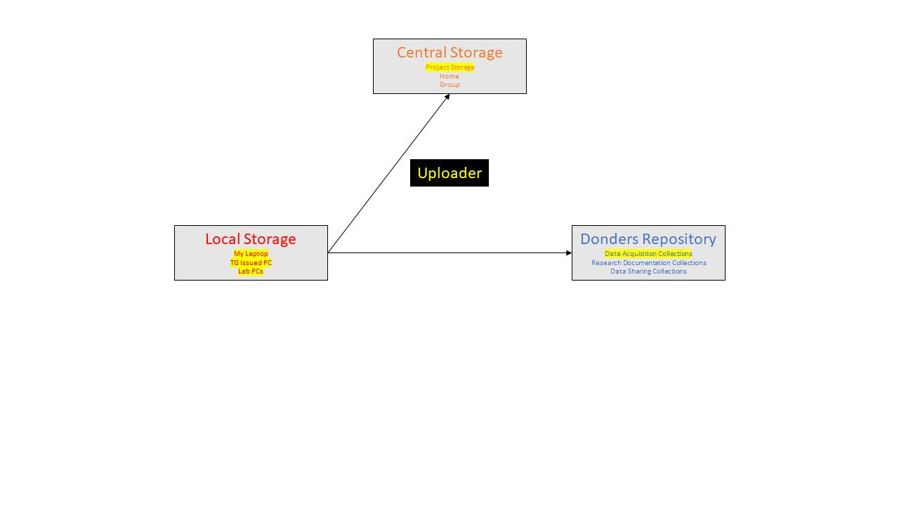

Data Transfer Tools
******************

The main purpose of this workshop is to give users experience with using the various Data Transfer Tools. 
Here, we list the data transfer tools which we offer support for. 

.. _Cyberduck: http://cyberduck.io
.. _Repocli: https://github.com/Donders-Institute/dr-tools/tree/main/cmd/repocli
.. _Stager: https://stager.dccn.nl
.. _Uploader: https://uploader.dccn.nl

Overview of data transfer tools
===============================

.. table::
   :widths: auto

   +-------------------+----------------+----------------+-------------------------+--------------------------------+
   |                   | `Cyberduck`_   | `Repocli`_     |  `Stager`_              | `Uploader`_                    |
   +===================+================+================+=========================+================================+
   | *user Interface*  | graphical      | comamnd-line   |  web                    | web                            |
   +-------------------+----------------+----------------+-------------------------+--------------------------------+
   | *transfer routes* | local <=> DR   | | local <=> DR |  project storage <=> DR | local <=> project storage + DR |
   |                   |                | | HPC <=> DR   |                         |                                |
   +-------------------+----------------+----------------+-------------------------+--------------------------------+
   | | *access*        |                |                | | DCCN Trigon network   | | DCCN Trigon network          |
   | | *restriction*   |                |                | | or `eduVPN`_          | | or `eduVPN`_                 |
   +-------------------+----------------+----------------+-------------------------+--------------------------------+
   | *OS support*      | | Windows      | | Windows      | | Windows               | | Windows                      |
   |                   | | MacOSX       | | MacOSX       | | MacOSX                | | MacOSX                       |
   |                   |                | | Linux        | | Linux                 | | Linux                        |
   +-------------------+----------------+----------------+-------------------------+--------------------------------+
   | *key feature*     | ease-of-use    | scriptable     | efficient               | automatic data organization    |
   +-------------------+----------------+----------------+-------------------------+--------------------------------+
   | | *recommanded*   |                |                |                         |                                | 
   | | *usage*         |                |                |                         |                                |
   +-------------------+----------------+----------------+-------------------------+--------------------------------+

Cyberduck
---------
A graphical tool for transferring data between local computer and the Donders Repository.  
It supports Windows and MacOSX. 
In principle, any WebDAV client will work: https://en.wikipedia.org/wiki/WebDAV. 
A generic data transfer tool. 

    Figure: Cyberduck

Repocli
---------
A command-line tool for transferring data between local computer and the Donders Repository.  
It supports Windows, MacOSX and Linux. 
Enables the user to script the upload or download of specific files from any repository. 
A generic data transfer tool. 

    Figure: Repocli

Stager
---------
https://stager.dccn.nl is a web-based tool which efficiently enables the user to move data between Project Storage and the Donders Repository. 
Requires the user to be connected to the Trigon Network - either physically or via VPN. 
Specifically created for DCCN use. 

    Figure: Stager

Uploader
---------
https://uploader.dccn.nl is a web-based tool which efficiently enables the user to move data from a local computer to both Project Storage and Data Acquisition Collections. 
Files are automatically stored in BIDS format and are both transferred and backed up in one fell swoop. 
Requires the user to be connected to the Trigon Network - either physically or via VPN. 
Specifically created for DCCN use. 

    Figure: Uploader

