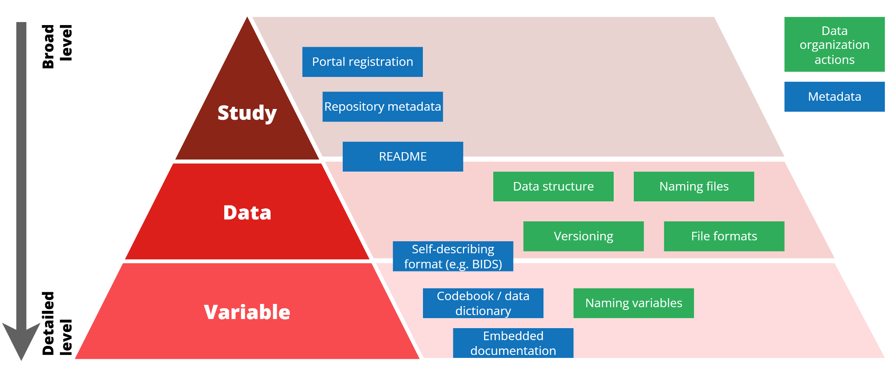
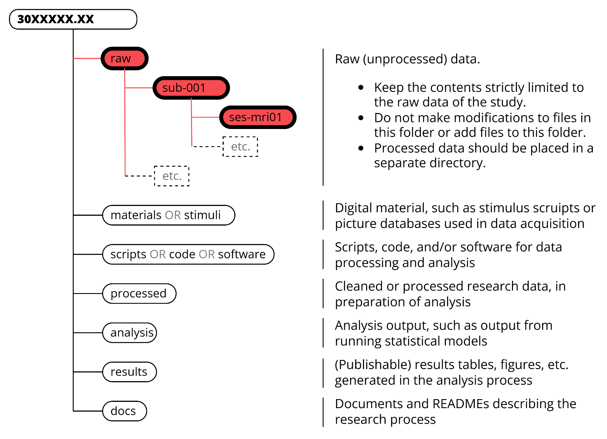

Efficient Storage Use
*********************

Efficient storage use is key because storage infrastructure is expensive and not unlimited. 
The more efficient our storage infrastructure is used, the more money is saved to spend on other aspects supporting the research we do. 
Efficient storage use starts with efficient data organization as part of research data management. 
The struggle with inefficient storage use is not that too much data is collected, but because it is unclear what data exists in a study, why it was generated, whether it is still needed, and whether data can be archived or removed. 
Good data organization makes answering these questions easier, thus resulting in more efficient use of the available storage.

In addition, good data organization has other benefits:

* It helps you to make sense of present and past studies that you revisit. It also helps team members to interpret your data in a better way.
* It keeps your work consistent over time.
* It saves time if you do it right from the start, allowing faster analysis times and speeding up the required data archiving and publication process towards the end of the study.
* It helps to make the data adhere more to the :bdg-info:`FAIR` criteria (*Findable*, *Accessible*, *Interoperable*, *Reusable*).

This is not a one size fits all guide, but it contains guidelines and best practices tailored to research at the :bdg-danger:`DCCN` and the most common data modalities we work with in the institute.

Planning Ahead
===============

Data organization starts before any data is acquired or analysed. 
Plan ahead, e.g. when starting a new research line, when starting your PhD, or when preparing a :bdg-primary:`PPM` proposal for a new study. 
A Data Management Plan (:bdg-success:`DMP`), required for each new :bdg-primary:`PPM`-approved study from 1 October 2026 onwards, can be used to plan data organization as part of overall data management. 
Examples of questions that you can ask yourself to optimize data organization and storage use, and that are covered in a :bdg-success:`DMP`, are:

* What data are you collecting? Which are the main modalities?
* Which labs, locations, and equipment do you use?
* How is data transferred to the project storage - the primary storage location for in-progress research data?
* What essential processing and cleaning steps are needed to make the data suitable for testing your study's hypothesis?
* How do you keep track of different versions of data that may arise during the research?
* Does all the generated data need to remain on the available (active) project storage for the entire study lifetime, or can certain raw and intermediate data be stored on archive storage after processing?
* What parts of the data directly underlie the research results and need to be preserved? What (intermediate) parts can be deleted, because they become obsolete or can easily be regenerated?

Data Organization Levels
========================

Data organization can be approached from different levels of detail, represented as a pyramid structure. 
Better organization at lower levels (data and variables) enables more informed decisions on the higher study level.

Study-Level Organization
------------------------

This is the high-level organization of a study and its associated research data and datasets. 
Example data management questions you need to answer for this level of organization include:

* What is the context of the study? Why is the study performed (what question(s) does it aim to answer)?
* What data is broadly generated in this study (e.g. main data modalities, such as :bdg-primary:`MRI`, :bdg-primary:`MEG`, :bdg-primary:`EEG`, etc.)?
* Which labs, locations and equipment are used?
* How many participants (are expected to) take part in the study?
* Who has access to the data, and who are involved in data management?

At the :bdg-danger:`DCCN`:

* Each :bdg-primary:`PPM`-approved study receives its own study-specific storage quota on the :bdg-primary:`DCCN project storage` (active or in-progress storage).
* The storage quota is linked to the study registration in the :bdg-primary:`DCCN Portal`, which contains metadata of the study such as registrations of ethical approval, financial details, ownership of the project, access to data, :bdg-primary:`Radboud Data Repository` (:bdg-primary:`RDR`) collections for archiving, etc.
* Because of the direct link between storage quota and the study registration in the :bdg-primary:`DCCN Portal`, it is not allowed to mix data of different studies or origin in one study-specific folder if that has leftover storage space. Each new study requires a separate :bdg-primary:`PPM` approval.

Data-Level Organization
-----------------------

This level concerns the structure of the dataset, folders, files, and versions. 
Example data management questions you need to answer for this level of organization include:

* Where will the data be stored and how is data organized in a logical file and folder structure?
* How is data transferred to the project storage - the primary storage location for in-progress research data? Or between other storage locations?
* What essential processing and cleaning steps are needed to make the data suitable for testing your study's hypothesis?
* How are files named? And how do you keep track of different versions of files that may arise during the research?
* Does all the generated data need to remain on the available (active) project storage for the entire study lifetime, or can data be stored on archive storage after processing (e.g. raw data, intermediate files, old versions)?
* What parts of the data directly underlie the research results and need to be preserved in the long term?
* What (intermediate) data can be deleted, because they become obsolete or can easily be regenerated?

Variable-Level Organization
---------------------------

The most detailed level of data organization in a study, regarding the organization of variables, what information is contained within each variable, and how variables can be used or interpreted. 
Example data management questions you need to answer for this level of organization include:

* What are suitable variable names?
* What do variables represent?
* Is data coded, and what coding schemes are applied?
* Which units of measurement are used in the data?

At these three levels of data organization, there are certain data organization actions that can be performed, as well as metadata providing context to the data to be added. 
Below are guidelines and best practices to achieve successful data management on all these levels.

Data Organization Actions
=========================

Data Structure
--------------

A clear folder structure is the foundation of data-level organization. 
A well-designed structure helps you to locate files quickly, understand relationships between data, and avoid unnecessary duplication.

**Raw data folder**

A raw folder is automatically generated in each new study-specific folder. 
This is an essential folder that must be used when acquiring new data.

* Data uploaded from labs is placed in this folder (either through automated data transfer of :bdg-primary:`MRI` and :bdg-primary:`MEG` labs, or through user-assisted upload via :bdg-dark:`Uploader`).
* New uploads in this folder trigger :bdg-dark:`Stager` to upload a copy of the data to the raw folder in the :bdg-primary:`Radboud Data Repository` (:bdg-primary:`RDR`) :bdg-primary:`Data Acquisition Collection` (:bdg-primary:`DAC`) linked to the study registration. 
  Note: this feature is currently only available for :bdg-primary:`RDR` collections in the :bdg-danger:`DCCN` or :bdg-danger:`DCC` organizational unit.

Because the raw folder represents the original acquired data:

* Only store original and unprocessed data here.
* Do not modify, overwrite, or reorganize raw data after upload.
* Store processed or derived data in separate folders (for example: ``processed``, ``analysis``, or ``results``).

.. Note:: Modifications made to files in the raw folder after upload are not synchronized with the corresponding :bdg-primary:`RDR` collection.

**Designing a folder structure**

Apart from the raw folder, the folder structure is largely up to the research team. 
Consider these best practices:

* Decide on a folder structure before the research starts. Make sure the structure requires minimal maintenance. Changing a folder structure when the project is underway is difficult and tedious.
* Store the empty folder structure somewhere and reuse it in every new future study. This saves time and makes your data management very consistent across studies.
* Keep the folder hierarchy shallow: a maximum of 3 or 4 subfolder levels.
* Document the structure (see the Metadata section).
* Ensure that all kinds of files and data have a clear and unique location in the structure.

Poor folder structures can lead to data duplication, ambiguous data locations (with data loss in worst case), and version mix-ups. 
All contributing to confusion and unnecessary expansion of used storage space.

At the :bdg-danger:`DCCN`, essential study documentation is stored separately from the research data (the data that is used for the actual answering of scientific research questions). 
For the so-called research-related data, your study will have a specific folder on the :bdg-primary:`Q-drive`.

File Names
-------------

File names are an important component of data-level organization. 
Consistent naming conventions improve navigation within a dataset and reduce confusion.

File names should be:

* **Consistent**: same information elements in the same order throughout the study.
* **Distinctive**: reflecting content or status of a file.
* **Meaningful**: descriptive and easy to understand.
* **Short**: balance length and readability (recommended: max. 32 characters, but exceptions can be necessary).
* **RDR-compliant**: The :bdg-primary:`RDR` - which you will likely frequently use - only accepts ``a-z``, ``A-Z``, ``0-9``, ``! @#$&()+=-_.,~[]/`'`` (many other tools and systems have similar restrictions on character use). Therefore, generally avoid special characters and accents on letters.

Choose a naming convention that works for you and the research team, and aim to decide on something that can be used consistently throughout studies.

Versioning
-------------

Versioning allows you to track changes in data, documentation, and analysis code over time. 
This is especially essential in collaborative studies to:

* Identify the most recent versions of data.
* Track modifications by team members.
* Support reproducibility.
* Prevent accidental overwriting of files.

Versioning also supports efficient storage use. 
Older versions of data may still need to be preserved, but may no longer be actively used at some point in the research process. 
Such versions can be placed on archive storage, only keeping the currently used version on the active project storage, leading to more efficient use of the storage system.

Good practice for versioning includes:

* Developing or agreeing on a format for versioning before a study starts.
* Avoiding ambiguous labels, such as 'draft', 'definitive', 'final', 'v2_final_revised', etc.
* Distinguishing between major and minor changes.

For example:

* Not recommended: ``Study_questionnaire_data_2026_05_03_FINAL_edits.csv``.
* Recommended:

.. code-block:: text

    Study_questionnaire_data_v01_00.csv
    Study_questionnaire_data_v01_01.csv
    Study_questionnaire_data_v02_00.csv

Which is consistent, unambiguous, and clearly indicates major and minor version changes.

For code and documentation, consider using a version-control system such as git: GitHub is best known, GitLab is an alternative that has RU-hosted instances running at the Faculty of Science or the Faculty of Social Sciences. 
Note: never store research data or personal data in open Git repositories.

File Formats
-------------

The choice of file formats can strongly influence long-term accessibility and interoperability of the data.

File formats are often associated with vendor-specific or commercial software that you use for data acquisition, processing or analysis. 
While these may be convenient or required in certain stages of the research process, they are not always suitable for re-use of data in the future: companies can change their software or go out of business, and data re-users may not have access to the required (often paid) software associated with the file formats.

To make data more interoperable - exchangeable between software, systems, and digital environments - consider using standardized or preferred file formats that are:

* Well documented.
* Widely supported.
* Independent of commercial parties or vendors.
* Accepted by data archives and repositories.

The guidelines for preferred file formats presented on the :bdg-primary:`RDR` website are a good starting point. 
In addition, there may be field-specific formats for storing data which are not covered here. 
Consider the standards in your research field before planning data organization.

Variable Names
--------------

Keep variable names and descriptions short, but unambiguous and meaningful. 
This improves interpretability and usability of the data.

For example:

.. code-block:: text

    WEIGHT_1
    WEIGHT_2
    WEIGHT_3

to capture weight at three separate sessions.

Rather than:

.. code-block:: text

    W1
    W2
    W3

which are shorter but not meaningful.

Or:

.. code-block:: text

    WEIGHT_first
    WEIGHT_second
    WEIGHT_last

which are more ambiguous.

The interpretation of the variables should be provided in the dataset's Metadata, e.g. in a codebook or embedded documentation (more in the Metadata section):

``WEIGHT_[1-3]`` = Weight of the participant in kilograms at the start of the session. The number indicates the session.

Metadata
===============

Metadata are data that describe other data. 
In the context of scientific research, metadata is data that describes the research data - the data that you use to answer scientific research questions and typically keep on the :bdg-primary:`DCCN project storage` and archive in the :bdg-primary:`RDR`. 
Metadata provide context, structure, and content information. 
They are essential to keep data manageable, understandable and reusable over time. 
Even well-structured datasets can become difficult to interpret when metadata is lacking.

Indirectly, metadata also support efficient storage use. 
When the purpose, contents, and status of datasets are clearly documented, it becomes much easier to determine:

* which data should be preserved;
* which data can be archived;
* which versions are obsolete;
* which files can be safely removed.

Metadata come in different forms, and each level of data organization has specific forms of metadata that support the interpretation and use of the data.

Study-Level Metadata
--------------------

Study-level metadata provide context of the study: an overview of the research objective(s), methods, participants, and measurements.

They answer the question: *What is this study and its data about?*

Good practices include:

* Completing all the metadata fields of the data repository you use for archiving and publication. Trusted repositories use metadata standards. For example, the :bdg-primary:`RDR` uses :bdg-info:`DataCite` and :bdg-info:`Dublin Core` standards. These standards contribute to the findability of your dataset.
* Providing enough information to allow others to understand the purpose and scope of the study without accessing the data themselves.
* Adding supplementary contextual information when repository metadata fields are insufficient.

A README is a practical way to provide additional study-level metadata. A README should:

* Be stored in the root folder of the dataset, so that it is easy to find.
* Be written in a widely accessible format, such as plain text (``.txt``) or Markdown (``.md``).
* Include contextual information so that the contents of the dataset can be understood (when repository metadata does not allow to cover all these aspects).

Data-Level Metadata
-------------------

Data-level metadata should provide information on structure and content, such as folder structure, files, relations between files, versions. 
Good data-level metadata help users navigate a dataset without having to inspect files individually. 
It can also support efficient storage management because it helps distinguish between raw data, processed outputs, material for archiving, and temporary or obsolete files for deletion.

They answer the question: *What files are present, how are they related, and how should they be used?*

Documentation should describe:

* The folder structure.
* The purpose of folders and files.
* Relationships between files.
* Processing steps and data provenance.
* Version history where relevant.

Aim to be complete, but concise. In most cases a short README is sufficient (you don't need to write a book about your dataset). Include:

1. General information:

   * Dataset title
   * Authors and contact information
   * Date of creation
   * Dataset version
   * Keywords
   * Funding information

2. Overview of data files:

   * Folder structure
   * Description of files and directories
   * Relationships between files
   * Creation dates
   * Version history

3. Methodological information:

   * Data collection methods
   * Processing and cleaning steps
   * Software used
   * Equipment and laboratory infrastructure used

4. Sharing and access information (when data is published):

   * Related datasets
   * Licences
   * Access restrictions
   * Publications associated with the dataset

Variable-Level Metadata
-----------------------

Variable-level metadata describe the contents of individual data files and explain how variables should be interpreted.

They answer the question: *What does the data represent, and how should it be interpreted?*

Variable-level metadata are often captured in codebooks or data dictionaries, and are less generic and more study- or discipline-specific.

Include information such as:

* Variable labels and definitions.
* Units of measurement.
* Coding schemes (incl. coding of missing values).
* Calculation methods for derived variables.

Aim to include all the information that is required for re-use and try to consider the perspective of the re-user.

Examples:

* A variable called ``HEIGHT`` with values 181, 190, 172 requires documentation on what the values represent, namely: height of the participant in centimetres.
* A variable called ``GENDER`` using a specific coding will require documentation that 1=female; 2=male; 3=gender-neutral; 99=missing/unreported.

Variable-level metadata may sometimes be already present when using self-describing formats for data organization to which generally documented standards apply. 
Some file formats allow to embed variable-metadata within the data file (e.g. SPSS allows to embed metadata).

Data Lifecycle and Storage Decisions
=====================================

Research data typically move through several stages during a study:

:bdg-warning:`Data acquisition` → raw data → :bdg-warning:`processing and cleaning` → processed data → :bdg-warning:`analysis` → results → :bdg-warning:`visualization`

As this cycle progresses, new data is continuously generated. 
Besides the main data underlying the results, these may include intermediate processing outputs, temporary working files, derived datasets, older versions, and exploratory analyses.

To promote efficient storage use, it is often unnecessary to keep all generated data available on active storage (:bdg-primary:`DCCN project storage`) throughout the study. 
Some files are only needed temporarily, while others are replaced by newer versions or can easily be regenerated from preserved inputs and processing scripts.

A key principle is therefore:

.. Note:: Active storage (i.e., the :bdg-primary:`DCCN project storage`) should contain data that are actively used. Data that are no longer actively used should either be archived or removed.

Archiving Versus Removal
------------------------

Data no longer actively used should generally fall into one of two categories:

1. **For archiving**: Archiving removes pressure from the active project storage while ensuring data remains available. Data should be archived when they remain scientifically valuable or are required for preservation, verification, reproducibility, future reuse, or publication.

   Examples generally include:

   * Raw research data
   * Final processed data
   * Publishable data
   * Metadata/documentation of archivable research data
   * Intermediate data that are computationally expensive to regenerate
   * Discontinued exploratory analyses that may be restarted in the future.

2. **For removal**: Removal permanently deletes data, resulting in less consumption of storage space. Data may be removed when they no longer provide scientific or practical value.

   Examples generally include:

   * Temporary working files.
   * Scratch files.
   * Failed processing output.
   * Duplicates of existing data.
   * Obsolete versions that have been replaced.
   * Intermediate data that can easily be regenerated from preserved inputs, code, and documented workflows.

Balancing Storage and Reproducibility
-------------------------------------

Decisions about archiving or removing data often involve a trade-off between storage costs and the effort required to recreate data.

As a general rule:

* If a dataset is expensive in terms of time, computational resources, or expertise to reproduce, archiving is often preferable.
* If a dataset can easily be regenerated from preserved raw data and documented processing steps, removal may be appropriate.

Well-documented and reproducible workflows make these decisions much easier. 
When processing steps are captured in scripts or notebooks, there is usually less need to retain every intermediate output indefinitely.

Preservation of Raw Research Data
---------------------------------

Raw research data form the original scientific record of a study and are therefore treated differently from most intermediate data products. 
Raw, unprocessed research data must be preserved for purposes of verification, replication, scientific integrity, and future reuse. 
These data must be archived for at least ten years after completion of the study and should thus never be deleted when the research is in progress. 
Researchers should therefore ensure that raw data are properly archived and documented throughout the project.

Storage Requirements and Best Practices for Data Modalities at the :bdg-danger:`DCCN`
=====================================================================================

.. list-table::
   :header-rows: 1

   * - Modality
     - Requirements
     - Best practices
   * - :bdg-primary:`MRI`
     - Once converted to NIFTI, DICOMs can only be kept on archive storage and must be removed from active storage and placed on archive storage (the corresponding study :bdg-primary:`DAC`). Exception: the research requires to keep working with the DICOMs, e.g. in methods or protocol development.
     - 
   * - :bdg-primary:`MEG`
     - 
     - 
   * - :bdg-primary:`EEG`
     - 
     - 
   * - :bdg-primary:`TUS`
     - 
     - 
   * - :bdg-primary:`Behavioral`
     - 
     - 

Sources
===============

van der Burgt, H., de Laat, S., Jansen, D., Lamers, D., Marcoux, K. & Slouwerhof, I. (2023, October 18). *Research Data Organisation*. Zenodo. https://doi.org/10.5281/zenodo.10013235

Demerdash, Y., Dockhorn, R. and Wilbrandt, J. (2025) 'Data Organization Made Easy: Comprehensive Folder Structure Template for Early Career Life/Natural Science Researchers', *Data Science Journal*, 24(), p. 35. Available at: https://doi.org/10.5334/dsj-2025-035.

.. dropdown:: Take Home Messages

    * :bdg-success:`RDM` starts with :bdg-primary:`data organization` - plan your folder structure, file naming and versioning before you start collecting data.
    * Keep only :bdg-warning:`actively used data` on active project storage; archive or remove the rest.
    * :bdg-primary:`Raw data` must be preserved for at least ten years after study completion and should never be deleted while the research is in progress.
