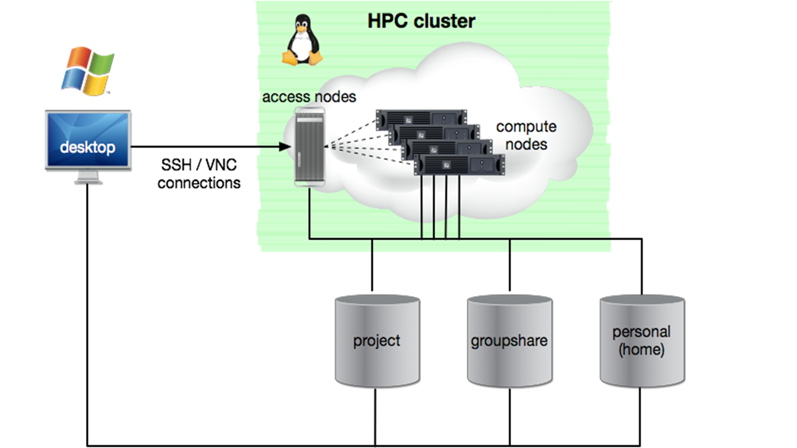

The High Performance Computing Cluster
*****************

This is a brief overview of what the HPC Cluster is, why it should be used, and how to access it. 
This is designed for people who have never accessed the HPC Cluster for the purposes of enabling them to do so. 
For those who have already followed the HPC Workshop, this part should be skipped.

**What is the HPC Cluster?**
===============================

The HPC Cluster is comprised of two groups of computers:

1. Access Nodes - these allow you to login and access the compute nodes
2. Compute Nodes - these are a pool of powerful computers which can run *jobs* (some kind of computation task) in parallel

    Figure: DCCN HPC Architecture

**Which storage facilities can I interact with on the HPC Cluster?**
===============================

While on the HPC Cluster,you have access to Central Storage, meaning that you have read-write access to files in the Project, Home, and Group Directories.

**Why should I use the HPC Cluster?**
===============================

* You need to access Central Storage while working virtually
* You have many jobs to run and you would like these to run simaltaneously rather than sequentially to save time (For Advanced Users because this requires BASH scripting)
* You want a job to run overnight but you want to turn your computer off

**How do I access the HPC Cluster?**
===============================

Necessary Conditions to Access the HPC Cluster
--------
* You have been vetted by the TG and now possess a TIQR token
* You have both PuTTY and TigerVNC downloaded on your computer

Exercise 1: How to start a VNC Session
----------
Please note: these instructions are designed for end-users with no experience or known preferences. 
These are the settings we believe will best serve most beginners. 
If you have other preferences, you should deviate from these instructions. 

1. Both PuTTY and TigerVNC are downloaded. 

* Download PuTTY here: https://www.puttygen.com/download-putty
* Download TigerVNC here: https://sourceforge.net/projects/tigervnc/files/stable/1.13.1/
* Open up the .exe files for each PuTTY and TigerVNC and install them

2. Establish a VPN connection to Trigon. 

* Open eduVPN and login. 
* After your login has been approved but before you establish the VPN connection, select ``RU Donders Institute Trigon (Full Access)`` in the dropdown menu. 
* Now, click the slider to connect. 

3. Start a VNC session

* Open PuTTY
* In the ``Host Name(or IP address)`` field, type ``mentat001.dccn.nl``
* In the ``Port`` field, type ``22``
* Click ``Open``
* Insert your DCCN credentials (the username for a person with Firstname Lastname is firlas)
* Type ``vncmanager`` into the terminal
* Type ``4`` to go to ``Set my VNC password`` and push ``enter`` to proceed
* Set your password ( it can be anything you want but you MUST remember it), push ``enter`` to proceed, verify the password, push ``enter`` to proceed, type ``n`` to skip setting a read-only password, and push ``enter`` to proceed
* Type ``2`` to go to ``Start a (VirtualGL) VNC server`` and push ``enter`` to proceed
* Push ``enter`` on the first host on the list to start your VNC server at the least occupied access node
* Push ``enter`` to select the default screen resolution for your computer
* Push ``y`` to prevent VNC from overlapping the Windows toolbar then ``enter`` to procee
* Push ``1`` to select the ``xfce - Lightweight XForm CE WIndow Manager``
* Type in your DCCN password (NOT the VNC password you just set)
* You should now be looking at a screen which says ``You have the following VNC servers running``: if you do not, go to the start screen of the vncmanager and push ``1`` to go to ``List my running VNC servers`` and push ``enter``

4. Open up the VNC GUI

* Open TigerVNC side-by-side PuTTY
* In the ``VNC server:`` of TigerVNC, type the name of the VNC server which is listed in PuTTY and then push ``enter``
* Insert the VNC password you just set in the previous step and then push ``enter``
* You have now opened the VNC GUI - it should look similar to your Desktop with a few differences

**Where can I learn more about the HPC Cluster?**
===============================

For a full documentation of the DCCN's HPC Cluster, go to https://hpc.dccn.nl/