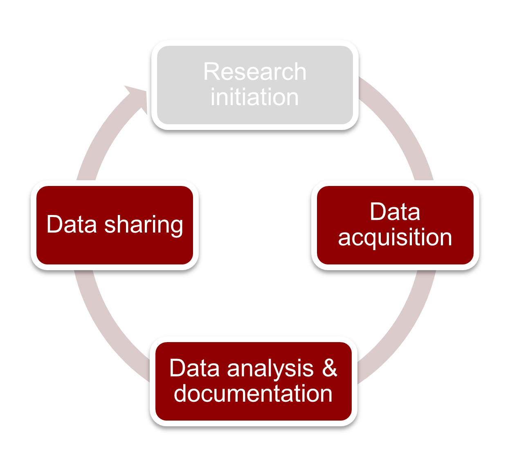

The Research Life Cycle
******************

In this course, we will have exercises which will give you practice with transferring data. 
In order to ensure that you have the skills necessary to manage data throughout the course of your project, we have structured these exercises to reflect your 
data managment needs in each of the 4 stages of the research cycle.

    Figure: Research Lifecycle

.. _Initiation: https://rdm.dccn.nl/docs/6_initation/index.html 
.. _Data Acquisition: https://rdm.dccn.nl/docs/7_acquisition/index.html
.. _Analysis and Documentation: https://rdm.dccn.nl/docs/8_analysis/index.html
.. _Sharing: https://rdm.dccn.nl/docs/9_sharing/index.html
.. table::
   :widths: auto

   +-------------------+-----------------------------+-----------------------------+-------------------------------+-----------------------------+
   |                   | `Initiation`_               | `Data Acquisition`_         | `Analysis and Documentation`_ | `Sharing`_                  |
   +===================+=============================+=============================+===============================+=============================+
   | *Starts With*     | Research Question           | First Experimental Session  | Final Subject                 | Article is Accepted         |
   +-------------------+-----------------------------+-----------------------------+-------------------------------+-----------------------------+
   | *Ends With*       | First Experimental Session  | Final Subject               | Article is Accepted           | Data is FAIR                |
   +-------------------+-----------------------------+-----------------------------+-------------------------------+-----------------------------+
   | *Tasks*           | | Designing Experiment      | | Recruiting Subjects       | | Creating Metadata           | | Make data FAIR            |
   |                   | | Running Simulations       | | Collecting Data           | | Analyzing Data              | | Anonymize Data            |
   |                   | | Analyzing Existing Data   | | Creating Metadata         | | Writing Results             | |                           |
   +-------------------+-----------------------------+-----------------------------+-------------------------------+-----------------------------+
   | *Data*            | | Analysis Scripts          | | Raw Data Files            | | Processed Data Files        | | Analysis Scripts          |
   |                   | | Existing Datasets         | | Metadata                  | | Analysis Scripts            | | Processed Data Files      |
   |                   | | Experiment Script         | | Surveys                   | | Metadata                    | | Metadata                  |
   +-------------------+-----------------------------+-----------------------------+-------------------------------+-----------------------------+