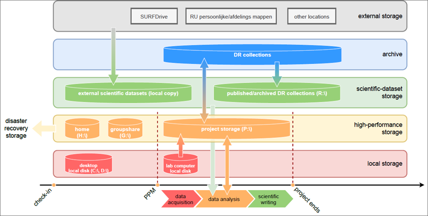

Data Management Plan
************

The data management plan outlines *what* data is stored *where* and *when*, *who* has access to the data and *why*?

At the DCCN, we have Standard Operating Procedures (SOPs) which have been developed as a guideline which answers these questions for the researcher.

These SOPs were developed for data sets which fall under the blanket ethical approval. 
Read more about the SOPs for Research Data Managment here:
  https://intranet.donders.ru.nl/fileadmin/user_upload/DCCN/Research/Standard_Operating_Procedures/RDM_compliance_monitoring_SOP_20180621.pdf
 

Read more about the SOPs for Preventing Data Leaks here: 
  https://intranet.donders.ru.nl/fileadmin/user_upload/DCCN/Research/CMO_Ethics_2016/NewTemplates_SOP/DataLeakage_SOP_DCCN_version_1_0_Sept_2016_newtemplate_01.pdf

If your study does not fall under the blanket ethical approval, you should contact the Data Steward for the DCCN: steven.ligthert@donders.ru.nl

Storage
===========
Moving data between storage facilities intuitively follows the researcher's needs and objectives at each point in the Research Life Cycle. 

    Figure: DCCN storage layers

This should serve as a benchmark for most data management plans. 
You should also ensure that personal data is kept separately from research data. 
Creating a data managment plan is the time to think about how you will do this.