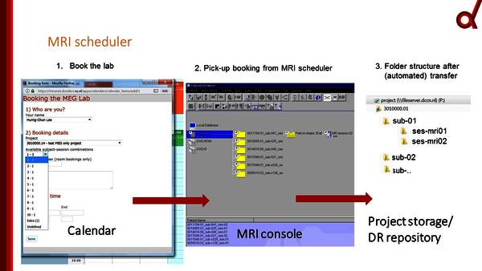

Data Acquisition
****************

This offers some examples of research data management practices which should be followed during data acquisiton.

How and when is data automatically transferred?
===============================================

At the DCCN, MRI and MEG data can be automatically transferred from the Local PC to both Project Storage and the Project's Data Acquisition Collection (DAC). 
This requires that you follow the proper protocol in booking the laboratory. 

Calendar
--------

You must make a booking using your name and project number at https://intranet.donders.ru.nl/calendars/. 
Here, you will assign the slot with a unique subject/session combination. 

If you follow the proper protocols during your experimental session listed below, your data will be automatically uploaded to Project Storage and the DAC. 
MRI data will be found in the Project storage at ``\project\1234567.89\raw\sub-XXX\ses-mriXX\``.
MEG data will be found in the Project storage at ``\project\1234567.89\raw\sub-XXX\ses-megXX\``.

MEG Protocol
------------

{}

MRI Protocol
------------

1. You have booked the subject in the correct scanner's calender
2. Prior to subject arrival, you find your project-subject-session combination in the MRI console
3. You ensure that all files have been transferred before you turn off the MRI PC

    Figure: Automatic Upload Workflow for MRI

How do I back data up as I collect it?
======================================

Whenever possible, you should move data from the laboratory PC onto project storage. 
Uploader was created to make this process as easy as possible. 

Exercise 8: Uploading with uploader.dccn.nl
-------------------------------------------

*Requires VPN Connection*

1. Create Experimental Data

* Open MatLab
* Go to the location where you unzipped ``RDM_Workshop Materials`` on your local PC
* Open the file ``WhatKindofFloridaManAreYou.m``
* Run the program and answer the questions as truthfully or untruthfully as you want

2. Login to Uploader

* Go to https://uploader.dccn.nl
* Type in your DCCN username (firlas) and password in the correct fields and then push login

3. Upload Your Data Files

* Under the ``Select project`` field select ``3010000.05``
* Under the ``Set subject label field`` insert the three numbers which have been given to you at the start of the workshop
* For the ``Set session label`` insert ``01``
* Under the ``Select data type field`` select ``beh``
* Open up File Explorer side-by-side the uploader window
* Go to the folder in your ``C:/Users/*/Downloads`` folder and locate ``Florida-Man-Results.csv``
* Drag ``Florida-Man-Results.csv`` and drop it in the ``Click or drag files to this area`` field in uploader.
* Push upload at the bottom right of your screen and close the window after the process has been completed

When should I use CasterEDC and why?
====================================

{}

Exercise 9: Importing DCCN screening forms
------------------------------------------

{}
