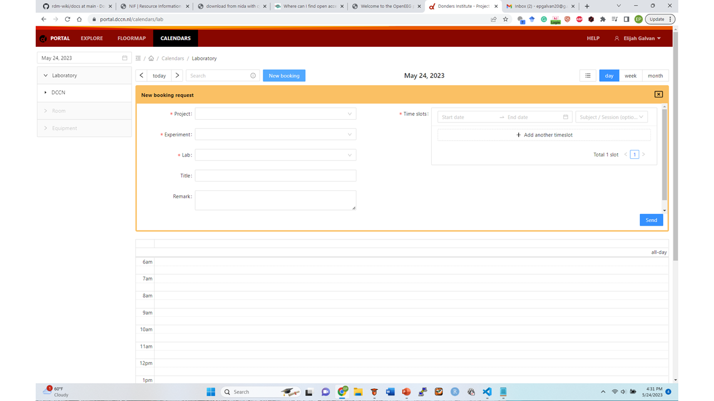

Calendar
************

About
==========
An automatic data transfer protocol has been created for both MRI and MEG data. 
This process will format your raw MRI/MEG data according to BIDS standards in your project's Project Folder and DAC.

Making a Calendar booking
===========
This automatic workflow starts with making a calendar booking at https://portal.dccn.nl. 
Login and click on ``Calendars`` on the top of the screen and then ``New Booking``. 

Next, select the Project Number of your Project, your modality, the lab you will use, and the timeslot that you and the participant have agreed upon. 
Now, choose the number you want to assign to the subject and the number of the session that you are booking. 
This subject and session number will determine where this subjects' data is saved to in the Project Folder and DAC.
Now click ``Send`` and you have successfully booked the lab!

Where to Find Automatically Uploaded Data
=================
If XXX is the subject number you assigned to a slot during calendar booking and YY is the session number:

MRI data will be found in the Project storage at ``\project\1234567.89\raw\sub-XXX\ses-mriYY\``.
MEG data will be found in the Project storage at ``\project\1234567.89\raw\sub-XXX\ses-megYY\``.

Booking is Not Enough
===============
Although booking the lab is necessary to enable automatic data transfer, data collected during that slot will **NOT** automatically be uploaded anywhere. 
You **MUST** collect your booking at the MRI/MEG console.