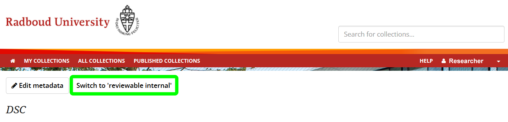
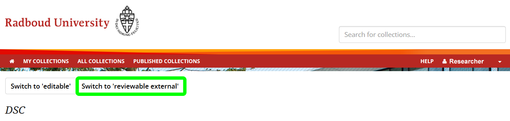
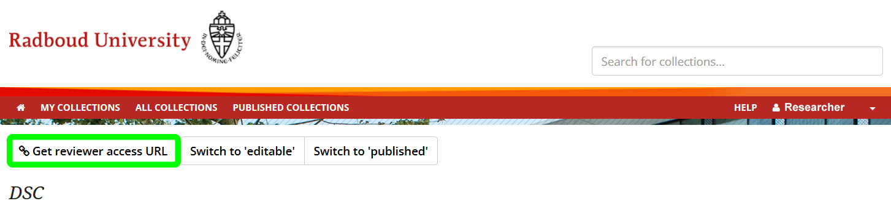
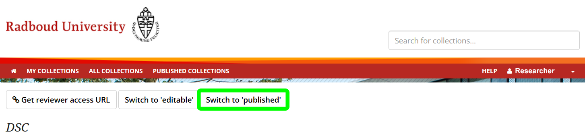

How to Publish Your Data Sharing Collection
**************************

1. Prepare the Collection

    * Ensure that there is no personal information, the collection is properly documented, and the collection is complete

2. Switch to Reviewable Internal

    * Log into the Donders Repository and select the collection you wish to publish
    * Select ``Switch to 'reviewable internal'`` near the top left of the screen and click confirm

    Figure: Switch to review internal

3. Switch to Reviewable External

    * Select ``Switch to 'reviewable external'`` near the top left of the screen and click confirm

    Figure: Switch to review external

4. Grant Reviewer Access

    * Select ``Get reviewer access URL'`` near the top left of the screen and copy the link
    * Share the URL with the editor of the journal you have submitted your article to (this grants anyone with this link the right to view a collection)

    Figure: Granting Reviewer Access

5. Switch to Publish

    * If your article has been accepted for publication, log into the Donders Repository and select the collection you wish to publish
    * Select ``Switch to 'published'`` near the top lefft of the screen and click confirm
    * Your article is now irreversibly published: the process will be complete within a few hours but you cannot undo this

    Figure: Publishing Your DSC