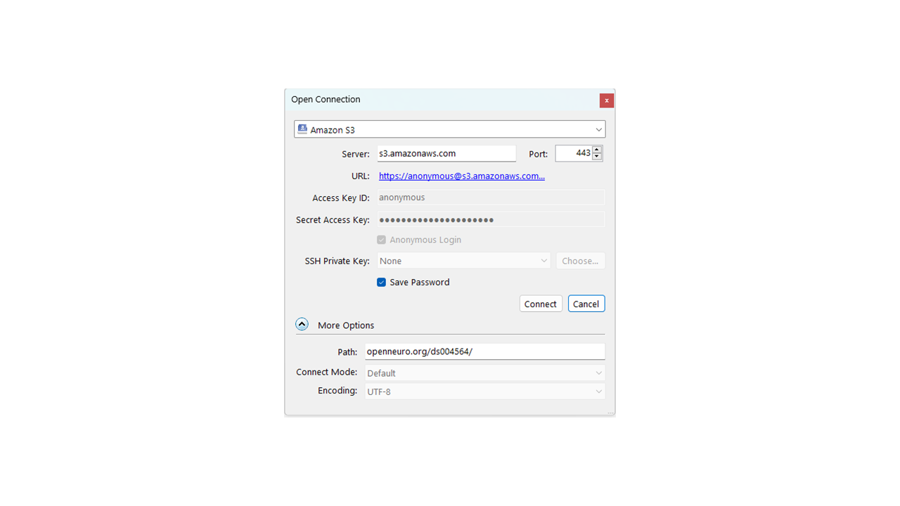

Exercise 3: Download Data from OpenNeuro Using Cyberduck
***********

Determine Which Protocol You Must Use to Download the Data.
======================

.. _Demo: https://openneuro.org/datasets/ds004564/versions/1.0.1
Let's say you have found a data collection you want to analyze on OpenNeuro called `Demo`_. 
Before you can go about downloading it with Cyberduck or Repocli, you must determine which protocol you must use to interact with the server. 
Below is a list of the Protocols required by some commonly used Open Access Repositories. 

.. table::
   :widths: auto

   +------------+----------+-----------+--------+
   | Repository | OpenfMRI | OpenNeuro | OMEGA  | 
   +============+==========+===========+========+
   | Protocol   | AWS      | AWS       | WebDAV |
   +------------+----------+-----------+--------+

1. Establish an AWS Connection to the OpenNeuro folder you want to download

* Open Cyberduck and push ``Open Connection``
* Click on the dropdown menu which defaults to ``FTP (File Transfer Protocol)`` and select ``Amazon S3``
* Click on the dropdown for more options and copy the domain name and the dataset number, seperated by a forward slash (i.e. ``openneuro.org/ds004564``) into the ``Path:`` field
* In the ``Access Key ID:`` field, type ``anonymous``

* Click ``connect``

2. Download the fMRI data

* Control-click the data you want to download (so the subject data folders and the ``participants.tsv`` file)
* Click ``Action`` and then ``Download To`` in the dropdown
* Select the directory you want to download the data to and then push ``OK``