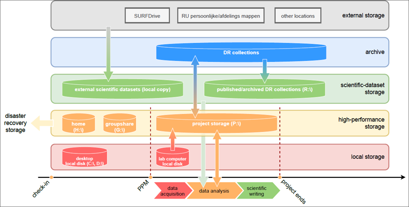

RDM in practice
***************

Data management plan
====================

Main question to be answered by the plan: which data is stored at where and why and who has access to the data.

We could show some examples and templates.

Good documentation
==================

Enrich the data with metadata.

RDM and coding
==============

In general it is about traceable changes on code and data.

Working centralized
===================

The idea is to encourage researchers to use central facility for research data, and to prevent data loss.  At DCCN it is linked to the storage facility offered for projects, and the Donders Repository.

    Figure: DCCN storage layers