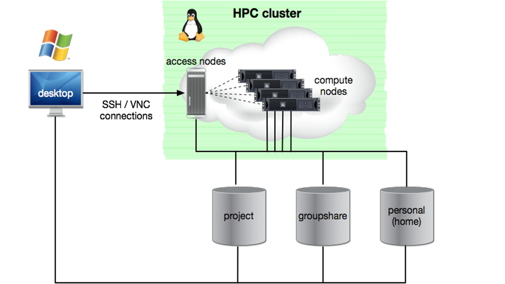

What is the HPC Cluster?
**********************

The HPC Cluster is comprised of two groups of computers:

1. Access Nodes - these allow you to login and access the compute nodes
2. Compute Nodes - these are a pool of powerful computers which can run *jobs* (some kind of computation task) in parallel

    Figure: DCCN HPC Architecture